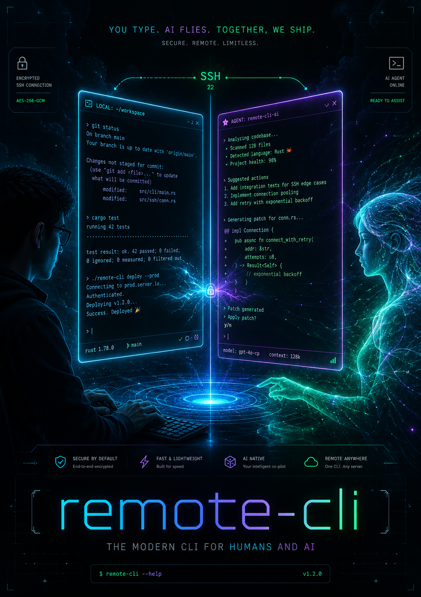

# remote-cli

<p align="center">
  
</p>

> **Shared SSH & Terminal CLI tool for AI Agent and Human Co-piloting.**

`remote-cli` allows a human user to start an interactive SSH session (handling passwords, 2FA, bastion hosts, and SSH keys themselves) and share that session with an AI Agent via a unique `session-id`.

---

## Key Features

- 🤝 **Real-Time Human & Agent Co-piloting**:
  - The human sees everything the Agent does in their original terminal window in real-time.
  - The human can continue typing and operating in the same session at any time.
- ⚡ **Zero External Binary Dependencies**:
  - Pure Python + POSIX PTY (`pty.openpty`, `termios`, `tty`).
  - No need to install `tmux` or `screen` on local or remote servers.
- 🤖 **First-Class AI Agent Support**:
  - `exec`: Structured execution of shell commands with stdout capture and return codes.
  - `snapshot`: In-memory 2D virtual terminal rendering (`pyte`) for clean screen capture (even for ncurses / curses / colored prompts).
  - `send`: Keystrokes and control signals (`Ctrl+C`, `Ctrl+D`, confirmation answers `y/n`).
  - `logs`: Fast access to recent scrollback history.
- 🔌 **Seamless Background Daemon**:
  - Communicates via Unix Domain Sockets (`~/.remote-cli/remote-cli.sock`).
  - Transparently auto-starts in the background on demand.
  - Safely detach (`Ctrl+]`) and re-attach (`remote-cli attach <session-id>`) anytime.

---

## Installation & Setup

Using [`uv`](https://github.com/astral-sh/uv):

```bash
# Clone the repository
git clone https://github.com/your-username/remote-cli.git
cd remote-cli

# Install dependencies and create venv
uv sync

# Run directly via uv
uv run remote-cli --help
```

---

## Quickstart & Workflow

### 1. Human Starts SSH Session
The user initiates the SSH connection to the remote machine. Once connected and authenticated, a `Session ID` is displayed:

```bash
uv run remote-cli ssh user@server.example.com
```

Output:
```text
╭────────────────────── remote-cli SSH Session ──────────────────────╮
│ Session Created: s_7f8a9b2c                                        │
│ Agent Command: remote-cli exec s_7f8a9b2c "<command>"               │
│ Press Ctrl+] to detach from session at any time.                  │
╰────────────────────────────────────────────────────────────────────╯
user@server.example.com's password: ***
user@server:~$ _
```

> **Tip**: You can also create local shell sessions for testing:
> ```bash
> uv run remote-cli session create --name my-session -- /bin/bash
> ```

---

### 2. Share `session-id` with AI Agent

Simply tell your AI Agent:
> *"I have logged into the server. The session ID is `s_7f8a9b2c`. Please check the disk space and restart Nginx."*

The Agent can now execute commands on the remote server via `remote-cli`:

```bash
# Agent runs a command and captures return code and stdout
uv run remote-cli exec s_7f8a9b2c "df -h"

# Agent runs a command with JSON output
uv run remote-cli exec s_7f8a9b2c "systemctl status nginx" --json

# Agent inspects the current 2D screen state
uv run remote-cli snapshot s_7f8a9b2c

# Agent sends an interactive response (e.g. confirming a prompt)
uv run remote-cli send s_7f8a9b2c "y"

# Agent sends Ctrl+C to interrupt a long-running process
uv run remote-cli send s_7f8a9b2c --ctrl-c
```

---

### 3. Human Observation & Intervention

While the Agent is executing commands, the human user sees all command text and outputs scrolling in real time in their terminal window. If needed, the human can type commands directly into that same terminal window.

---

## CLI Command Reference

| Command | Description |
| :--- | :--- |
| `remote-cli ssh [SSH_ARGS...]` | Start SSH session, print Session ID, and attach immediately |
| `remote-cli session create [-d] [-- <CMD...>]` | Create a new session (default: `/bin/bash`) |
| `remote-cli session list` (or `ls`) | List all active and recent sessions |
| `remote-cli session attach <ID>` (or `attach`) | Attach terminal in raw mode to existing session |
| `remote-cli session close <ID>` | Close and terminate a session |
| `remote-cli exec <ID> "<COMMAND>"` | Execute command in session, capture output & exit code |
| `remote-cli send <ID> [TEXT]` | Send raw keystrokes or control keys (`--ctrl-c`, `--ctrl-d`) |
| `remote-cli snapshot <ID>` | Capture 2D terminal screen state (ANSI-rendered) |
| `remote-cli logs <ID> [-n LINES]` | View recent output scrollback logs |
| `remote-cli daemon start / stop / status` | Manage background daemon lifecycle |

---

## Architecture

```text
┌─────────────────────────┐          ┌───────────────────────────┐
│   Human User Terminal   │          │     AI Agent / Script     │
│       (Raw Mode)        │          │ (remote-cli exec/snapshot)│
└────────────┬────────────┘          └─────────────┬─────────────┘
             │                                     │
             │   Attach (Stdin/Stdout stream)      │ JSON Request/Response
             ▼                                     ▼
   ┌─────────────────────────────────────────────────────────────┐
   │             remote-cli Daemon Process                       │
   │       (Unix Domain Socket: ~/.remote-cli/remote-cli.sock)   │
   │                                                             │
   │  ┌────────────────────────────────────────────────────────┐ │
   │  │ Session (e.g. s_7f8a9b2c)                              │ │
   │  │  - Master/Slave PTY (`pty.openpty`)                    │ │
   │  │  - Pyte Virtual Terminal Screen (`pyte.HistoryScreen`) │ │
   │  │  - Scrollback Ring Buffer                              │ │
   │  │  - Exec Sentinel Detection Engine                      │ │
   │  │  - Process: `ssh user@remote-server` (or local shell)  │ │
   │  └────────────────────────────────────────────────────────┘ │
   └─────────────────────────────────────────────────────────────┘
```

---

## Running Tests

```bash
uv run pytest -v
```
